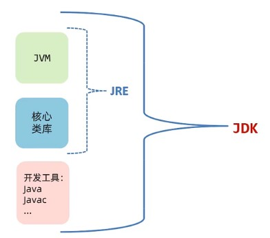
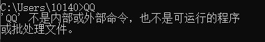
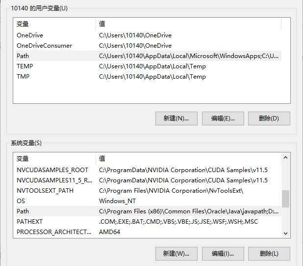
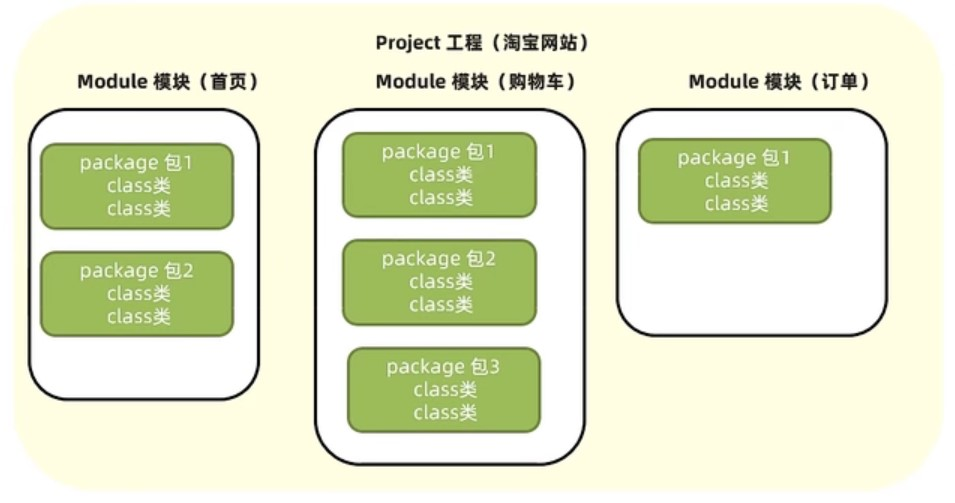

#### 前提知识

#### cmd常用命令

| 常用命令 | 作用                                                         |
| -------- | ------------------------------------------------------------ |
| `盘符：` | 切换到某个盘下  D:  ,  C:                                    |
| `dir`    | 查看当前路径下的文件信息                                     |
| `cd`     | 进入单级目录：`cd itheima`<br />进入多级目录：`cd D:\Java\bin`<br />回到上一级目录：`cd ..`<br />回到盘符根目录：`cd \` |
| `cls`    | 清屏                                                         |

#### Java基础

​		javac.exe用于编译，java.exe用于执行

​		文件名必须与代码类名称一致

##### 新手程序入门—打印 Hello World

```java
public class HelloWorld{
    public static void main(String[] args) {
        System.out.println("Hello World");
    }
}
```

​		将上述代码保存至一个`.java`程序，然后在cmd窗口切换到当前路径（可以直接在windows资源管理器上面输入cmd即可调出），分别输入以下代码：

```java
javac HelloWorld.java  # 编译
java HelloWorld        # 运行类
```

​		**文件名必须与代码类名称一致，否则编译会出错！**

​		JDK11后可以直接运行源文件，直接`java HelloWorld`就能运行

#### JDK组成

##### JVM

​		JVM(Java Virtual Machine)：Java虚拟机，真正运行Java程序的地方

##### 核心类库

​		Java自己写好的程序，给程序员自己的程序调用的

##### JRE

​		JRE(Java Runtime Environment)：Java的运行环境，由JVM和核心类库组成

##### JDK

​		JDK(Java Development Kit)：Java开发工具包，由上面所有东西组成、



#### Path环境变量

​		在cmd中想要运行一个程序，例如，我们想要通过cmd来启动QQ



​		系统首先会在当前路径`C:\Users\10140`中查找QQ程序，找不到时，会在系统的环境变量Path中查找，如果还找不到，那么系统会报错。



​		系环境变量中有一个系统变量和一个用户变量，在用户变量中Path设定，那么只对该用户有效；在系统变量Path中设定，则对所有用户有效。

​		**配置Java环境变量时，找到`java.exe`和`javac.exe`所在的目录，添加到环境变量中；配置JAVA_HOME环境变量时，找到JDK所在的目录，首先在变量中定义一个JAVA_HOME，路径为JDK的安装目录，然后再Path中添加`%JAVA_HOME%\bin`即可。**

#### IDEA project结构

- project（项目、工程）
- module（模块）
- package（包）
- class（类）



| 快捷键         | 说明                                   |
| -------------- | -------------------------------------- |
| main           | public static void main(String[] args) |
| sout           | System.out.println();                  |
| Ctrl + D       | 复制当前数据到下一行                   |
| Ctr l+ /       | 对代码进行注释                         |
| Ctrl + Alt + L | 代码格式化                             |


