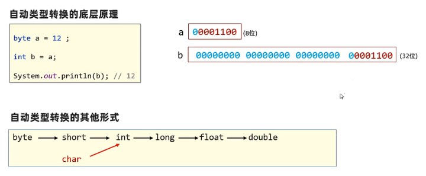
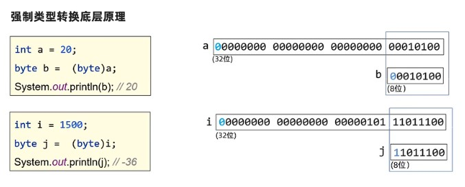

### Java基础语法

#### 注释

| 注释             | 说明                   |
| ---------------- | ---------------------- |
| `//`             | 单行注释               |
| `/*...*/`        | 多行注释               |
| Ctrl + /         | 对选定的代码段单行注释 |
| Ctrl +Shift +  / | 对选定的代码段多行注释 |

#### 字符和字符串

​		字符指单个字符，需要用单引号圈起来；字符串有多个字符，用双引号

```java
System.out.println('a');
System.out.println('aasd');  //会报错

System.out.println('\n');  //换行
System.out.println('\T');  //缩进tab

System.out.println("asdasd");
```

> println 本身会换行，因此`System.out.println('\n');`会换两行；`System.out.print(' ');`不会换行

#### 变量

```JAVA
duoble num = 6.0;  //定义小数num变量
num = num + 4.0;   //对num进行操作

int age = 18;      //定义整型变量age
age = 25;

char ch='a';        //定义字符变量

int i1 = 0b01100001;     //二进制要以0b开头(b大小写均可)
System.out.println(i1);  // 97

int i2 = 0141;           //八进制以0开头
System.out.println(i2);  // 97

int i3 = 0x61;           //十六进制以0x开头(x大小写均可)
System.out.println(i3);  // 97

String ah="asdsaf";      //S要大写
System.out.println(ah);
```

#### 数据类型

|    数据类型    |      关键字      | 内存占用(字节数) |
| :------------: | :--------------: | :--------------: |
| 整数(-128~127) |       byte       |        1         |
|      整数      |      short       |        2         |
|  整数(10位数)  |  **int(默认)**   |        4         |
|  整数(19位数)  |       long       |        8         |
|     浮点数     |      float       |        4         |
|     浮点数     | **double(默认)** |        8         |
|      字符      |       char       |        2         |
|     字符串     |      String      |        /         |
|      布尔      |     boolean      |        1         |

```java
long lg = 132223243244244L;
    //定义long类型时，如果数据超过int范围但未超过long范围也会报错，需要再数据后面加上L或者l
long lg2 = 132223243244244;  
    //报错

float score = 98.5F;
    //定义float类型时，同理
float score2 = 98.5;
    //报错
```

#### 自动类型转换

​		**字节数小的可以自动转换到字节数大的**

```JAVA
byte a = -12;          //1个字节
int b = a;             //4个字节 
System.out.println(b); //自动转换

int c = 23;            //4个字节
double ac = c;         //8个字节
System.out.println(ac);

char ch = 'a';         //2个字节  00000000 01100001
int code = ch;         //4个字节  00000000 00000000 00000000 01100001 补0转化
System.out.println(code);
```



- 表达式的最终结果由表达式中**最高类型决定的**
- **表达式中**，byte、short、char是**直接转化成int**参与运算的

> 表达式指的是`res = a + b + c`等

```JAVA
byte a = 10;
int b = 20;
double c = 1.5;
double r = a + b + c;
// int r = a + b + c;  //报错
System.out.println(r);

byte i = 10;
byte j = 20;
int k = i + j;
//  byte k = i + j;  //报错
System.out.println(k);
```

#### 强制类型转化

```JAVA
int a = 20;
byte b = (byte) a;
System.out.println(b);  // 20

int i = 1500;
byte j = (byte) i;
System.out.println(j);  // -36

double x = 95.6;
int y = (int) x;
System.out.println(y);  // 95
```



- 强制类型转换**可能造成数据（丢失）溢出**
- 浮点型强制转换成整型，**直接丢掉小数部分，保留整数部分**

#### 运算符

```JAVA
int a = 10;
int b = 3;
System.out.println(a + b);  // 13
System.out.println(a - b);  // 7
System.out.println(a * b);  // 30

System.out.println(a / b);  // 3
System.out.println(a * 1.0 / b);  // 3.3333333333333335 要在前面*1.0，因为运算顺序

System.out.println(a % b);  // 1 取余
```

#### 连接符

```JAVA
int a = 5;
System.out.println("abc" + a);          //abc5
System.out.println("abc" + 'a');        //abca
System.out.println("abc" + 15 + 'a');   //abc15a

System.out.println('a' + a);            //102
System.out.println(a + 'a' + "asdf");   //102asdf
System.out.println("asdf" + (a + 'a')); //asdf102
```

​		**注意，没有字符串时是转为int运算，有字符串时要看顺序，字符串在前面则是连接，字符串在后面则是先int运算再连接。**

#### 自增/自减

```java
int b = 10;
int c = b++;
System.out.println(c);  // 10

int b = 10;
int c = ++b;
System.out.println(c);  // 11
```

​		**+或-号在前面，先运算再赋值；+或-号在后面，先赋值再运算。**

```java
int k = 3;
int p = 5;
int rs = k++ + ++k - --p + p-- - k-- + ++p + 2;
System.out.println("k=" + k);   // 4
System.out.println("p=" + p);   // 4
System.out.println("rs=" + rs); // 9
```

#### 逻辑运算符

| 符号 | 介绍 | 说明                                                         |
| :--: | :--: | :----------------------------------------------------------- |
| `&`  |  与  |                                                              |
| `|`  |  或  |                                                              |
| `!`  |  非  | `!true=false`、`!false=true`                                 |
| `^`  | 异或 | 两个同为false或true时返回false，否则返回true（同为flase，不同为true） |

#### 三元运算符

`条件表达式 ? 值1:值2;`

```java
int s = 1, f = 2;
System.out.println(s < f ? true : false);  // true
```

```java
int x = 10, y = 30, z = 50;
int max = x > y ? x > z ? x : z : y > z ? y : z;  // 嵌套算法
System.out.println(max);
```


#### API(Application Programming Interface，应用程序编程接口)

```java
import java.util.Scanner;

//得到一个键盘扫描器对象
Scanner sc = new Scanner(System.in);

// 调用sc对象的功能等待接收用户的输入数据
System.out.print("input:");
int age = sc.nextInt();
System.out.println("age:" + age);
```

