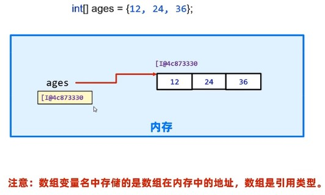

### 数组

#### 数组定义

`数据类型[] 数组名 = new 数据类型[]{元素1,元素2,...};`

```JAVA
double[] scores = new double[]{89.9, 98.2, 64.5};
double[] scores = {89.9, 98.2, 64.5};  // 简化写法
double scores[] =  {89.9, 98.2, 64.5}; // 另一种写法，较少见

int[] ages = new int[]{12,24,35,48};
int[] ages = {12,24,35,48};  // 简化写法

String[] names = new String[]{"Zhang","Wang","Li"};
String[] names = {"Zhang","Wang","Li"};  // 简化写法
```

##### 基本原理



​		数组变量名存的是一个地址，引用数组时根据变量名存的地址来访问。

#### 数组访问

```JAVA
int[] ages = {12,24,35,48};
System.out.println(ages[1]);  // 24
System.out.println(ages.length);  // length函数输出数组长度

ages[2] = 50  // {12,50,35,48} 重新赋值
```

#### 动态初始化数组

`数组类型[] 数组名 = new 数据类型[长度]`

```java
// 动态初始化数组
int[] num = new int[5];  // 默认值为0
num[0] = 5;   // 赋值
System.out.println(num[0]);
// String数组默认值为null，字符数组char也是0，double是0.0，bool是false

// 字符数组默认值
char[] chars=new char[100];
System.out.println(chars[0]);      // 会输出一个奇怪的符号
System.out.println((int)chars[0]); // 转化为0
```

#### 数组遍历

```java
int[] num = new scores[]{15,95,62,48,123};
for (int i = 0; i < scores.length; i++) {
    System.out.print(scores[i] + "\t");
}

// 另一种写法
for (int score : scores) {
    System.out.print(score + "\t");
}
```

##### 冒泡排序

```java
int[] array = {5, 1, 6, 4, 8, 7};
for (int i = 0; i < array.length; i++) {
    for (int j = 0; j < array.length - 1; j++) {  // 注意-1
        if (array[j] > array[j + 1]) {
            int temp = array[j];
            array[j] = array[j + 1];
            array[j + 1] = temp;
        }
    }
}

// 输出排序后的数组
for (int j : array) {
    System.out.print(j + "\t");
}
```

#### 内存分配


> 注意：两个变量指向同一个数组时，其堆内存中的内容只有一个，任何一个变量改变其内容都会改变。例如：通过arr2改变数组中的内容，arr1访问时是改变后的内容。跟python不太一样