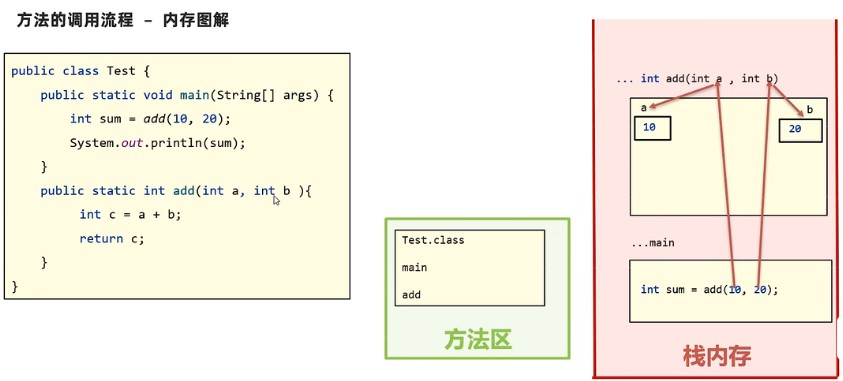
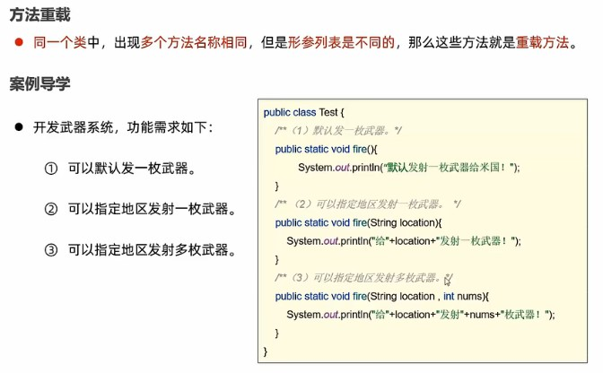

### 函数

##### 函数定义

```JAVA
// example
// 定义int返回值函数
public static int sum1(int a, int b) {
    return a + b;
}

// 无返回值函数
public static void printHello() {
        System.out.println("Hello");
        System.out.println("Hello");
        System.out.println("Hello");
    }
```

##### 案例

```java
// 求1-n的和
public static int sumall(int n) {
    int sum = 0;
    for (int i = 1; i <= n; i++) {
        sum += i;
    }
    return sum;
}

// 判断奇偶数
public static void judge(int a) {
    if (a % 2 == 0) {
        System.out.println(a + "是偶数");
    } else {
        System.out.println(a + "是奇数");
    }
}

// 求数组中的最大值
public static int maxarr(int[] arr) {
    int max = 0;
    for (int j : arr) {
        if (j > max) {
            max = j;
        }
    }
    return max;
}
```

#### 函数内存原理

- 函数**没有被调用**时，在**方法区**中的字节码文件中存放
- 函数**被调用**时，需要进入到**栈内存**中运行



#### 函数值传递

##### 基本类型参数传递

```java
public static void main(String[] args) {
    int a = 10;  // 实参
    System.out.println("a=" + a); // 10
    change(a);
    System.out.println("a=" + a); // 10   形参的改变不影响实参
}

public static void change(int a) {
    a += 10; // 形参
    System.out.println("change a:" + a); // 20
}
```

- 形参：函数定义时的变量

- 实参：在函数内部定义的变量

  > 值传递，传输的是**实参存储的值**

##### 引用类型参数传递

```java
public static void main(String[] args) {
    // 调用changearr
    int[] arr = {1, 2, 3};
    System.out.println("arr[1]=" + arr[1]);  // "arr[1]=1
    changearr(arr);  // 数组是引用类型参数，传递的是数组所在的地址
    System.out.println("change arr[1]=" + arr[1]);  // "arr[1]=50
}
public static void changearr(int[] arr) {
    arr[1] = 50;
}
```

##### 案例

1.按照如下格式打印数组：`[1,2,3,4,5]`

```java
public static void main(String[] args) {
    // 调用printarr
    int[] arr1 = {1, 2, 3};
    printarr(arr1); // [1,2,3]
}

public static void printarr(int[] arr) {
    System.out.print("[");
    if (arr!=null && arr.length>0) {  // 判断是否是空数组,不然会有bug,容易报错
        for (int i = 0; i < arr.length; i++) {
            // 简化代码
            System.out.print(i == arr.length - 1 ? arr[i] : arr[i] + ",");
        }
    }
    System.out.print("]");
}
```

2.判断两个数组是否一模一样

```java
public static void main(String[] args) {
    int[] arr1 = {1, 5, 6, 2};
    int[] arr2 = {1, 5, 5, 2};
    System.out.println(compare(arr1, arr2));
}

public static boolean compare(int[] arr1, int[] arr2) {
    if (arr1.length == arr2.length) {
        for (int i = 0; i < arr1.length; i++) {
            if (arr1[i] != arr2[i]) {
                return false;
            }
        }
        return true;
    } else {
        return false;
    }
}
```

#### 函数重载



​		只需判断**方法名称相同，形参列表不同**即可判断是否是方法重载

```JAVA
public static void main(String[] args) {
    fire();
    fire("USA");
    fire("USA", 5);
}

public static void fire() {  // ()内是形参列表,fire是方法名称
    System.out.println("Fire!");
}

public static void fire(String location) {
    System.out.println("Fire on " + location);
}

public static void fire(String location, int n) {
    System.out.println("Fire " + n + " missiles on " + location);
}
// Fire!
// Fire on USA
// Fire 5 missiles on USA
```

##### 改进：

```JAVA
public static void main(String[] args) {
    fire();
    fire("USA");
    fire("USA", 5);
}

public static void fire() {
    // System.out.println("Fire!");
    fire("USA");
}

public static void fire(String location) {
    // System.out.println("Fire on " + location);
    fire(location, 1);
}

public static void fire(String location, int n) {
    System.out.println("Fire " + n + " missiles on " + location);
}
// Fire 1 missiles on USA
// Fire 1 missiles on USA
// Fire 5 missiles on USA
```

​		**方法重载间可以相互调用**

#### 补充：return的单独使用

```JAVA
public static void main(String[] args) {
    int a = 10, b = 0;
    chu(a, b);
}

public static void chu(int a, int b) {  // void函数,int不能单独用return
    if (b == 0) {
        System.out.println("除数不能为0");
        return;  // 跳出当前方法，并结束当前方法的执行(只能在void中用)
    }
    System.out.println(a / b);
}
```

