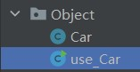
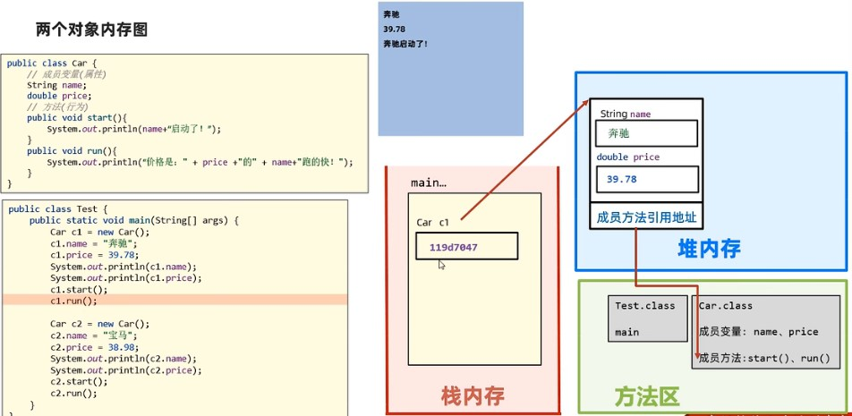
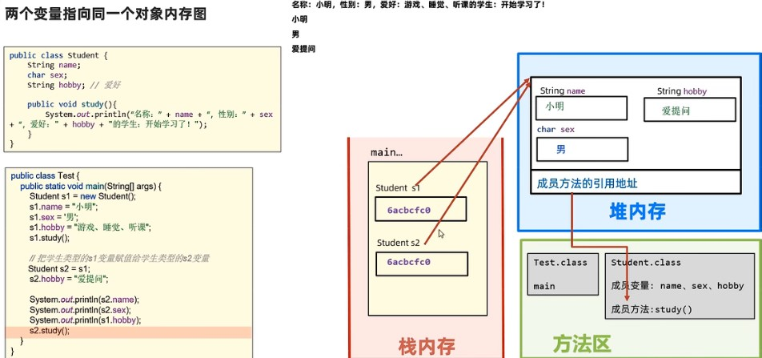
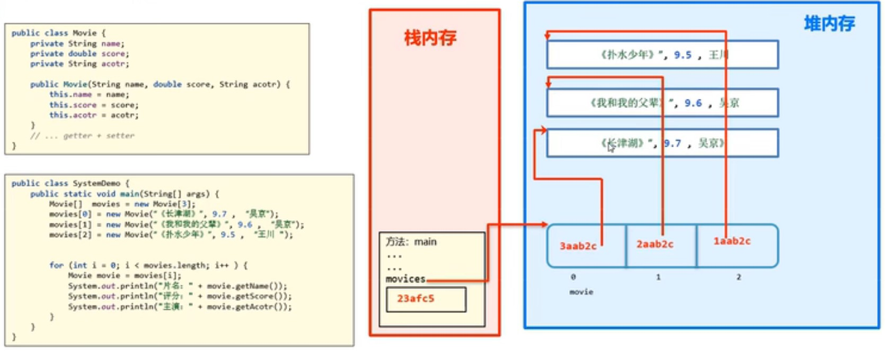

### 面向对象

##### example

```java
// 设计类
public class Car{
    // 属性
    String name;
    double price;
    
    // 行为(方法)
    public void start(){
        System.out.println("Car start!");
    }
    public void run(){
        System.out.println("Car run!");
    }
}

// 创建类的对象
// 类名 对象名 = new 类名()
Car c = new Car();
```

##### 调用类



```java
// 将定义的类和需要调用类的程序放在同一个package中
public static void main(String[] args) {
    Car c = new Car();
    Car[] c2 = new Car[100];  // 定义一个Car对象数组
    c.name = "Baoma";
    c.price = 99.9;
    System.out.println(c.name);
    c.start();
    c.run();
}
```

- 一个java文件可以定义多个类，但是只能用一个public修饰
- java文件名必须是public修饰的类名
- 建议一个类一个文件

```java
// Car.java  文件名要和public修饰的类名相同
public class Car{
    ...
}

class flight{
    ...
}
```

#### 对象在内存中的运行机制



​		类存放在方法区，类的对象存放在堆内存中，对象属性存放在对象中(堆内存)，定义的对象c1存放的是对象在堆内存中的地址，方法(类函数)是在**栈内存中运行的**

##### 两个变量指向同一个对象



##### 垃圾回收

 		对于没有被引用的对象，被视为”垃圾“，Java存在自动垃圾回收器，会定期对垃圾进行清理。

##### 案例——模拟购物车

##### 定义商品类

```java
public class Goods {
    int id;  // 商品id
    String name;  // 商品名称
    double price;  // 商品价格
    int buynum;  // 商品购买数量
}
```

##### 创建购物车(定义商品对象数组)

##### main程序

```java
public class Shopcar {
    public static void main(String[] args) {
        Goods[] shopcar = new Goods[100]; // 定义购物车对象,包含100个商品
        Scanner sc = new Scanner(System.in);  // 创建键盘输入对象
        addGoods(shopcar, sc);  // 添加商品功能
        check(shopcar, sc);     // 查询商品功能
    }
}
```

##### addGoods

```java
// 添加商品函数
public static void addGoods(Goods[] shopcar, Scanner sc) {
    // 录入商品信息
    System.out.print("Input Goods ID:");
    int id = sc.nextInt();
    System.out.print("Input Goods name:");
    String name = sc.next();
    System.out.print("Input Goods num:");
    int num = sc.nextInt();
    System.out.print("Input Goods price:");     
    double price = sc.nextDouble();

    // 将商品信息封装成一个商品对象
    Goods g = new Goods();
    g.id = id;
    g.name = name;
    g.buynum = num;
    g.price = price;

    // 将商品对象添加到购物车中,遍历，找出数组的末尾所在位置
    for (int i = 0; i < shopcar.length; i++) {
        if (shopcar[i] == null) {
            shopcar[i] = g;
            System.out.println("Goods have been added!");
            break;
        }
    }
}
```

##### check

```java
// 查询功能
public static void check(Goods[] shopcar, Scanner sc) {
    System.out.println();
    System.out.println("Check with Goods ID:ID");
    System.out.println("Check with Goods name:name");
    String method = sc.next();
    switch (method) {
        case "ID":
            System.out.print("Input Goods ID:");
            int id = sc.nextInt();
            for (int i = 0; i < shopcar.length; i++) {
                if (shopcar[i].id == id) {
                    display(shopcar[i]);
                    break;
                }
            }
            break;
        case "name":
            System.out.print("Input Goods name:");
            String name = sc.next();
            for (int i = 0; i < shopcar.length; i++) {
                if (Objects.equals(shopcar[i].name, name)) { // 字符串比较
                    display(shopcar[i]);
                    break;
                }
            }
            break;
        default:
            System.out.println("Something wrong!");
    }
}
```

##### display

```java
public static void display(Goods g) {
    System.out.println("Goods ID:" + g.id);
    System.out.println("Goods name:" + g.name);
    System.out.println("Goods price:" + g.price);
    System.out.println("Goods buynum:" + g.buynum); 
}
```

#### 构造器

- 定义在类中，用于初始化一个类的对象，并返回对象地址

- **无参数构造器（默认）**：初始化对象时，成员变量数据均采用默认值
- **有参数构造器**：初始化对象时，同时可以接收参数作为对象进行赋值

##### 注意

- 任何类定义出来，默认自带了无参数构造器，写不写都有
- 一旦定义了有参数构造器，无参数构造器就没有了，如果还想用无参数构造器，就要自己手写一个

##### example

##### Car类定义 Car.java

```JAVA
public class Car {
    String name;
    double price;

    // 无参数构造器
    public Car() {
        System.out.println("无参数构造器被调用了");
    }

    // 有参数构造器
    public Car(String n, double p) {
        System.out.println("有参数构造器被调用了");
        name = n;
        price = p;
    }
}
```

##### 构造器调用 Car_Test

```java
public class Car_Test {
    public static void main(String[] args) {
        // 调用无参数构造器
        Car c1 = new Car();
        c1.name = "Baoma";
        c1.price = 99.9;
        System.out.println(c1.name);
        System.out.println(c1.price);

        // 调用有参数构造器
        Car c2 = new Car("Bengchi", 88.8);
        System.out.println(c2.name);
        System.out.println(c2.price);
    }
}
// 无参数构造器被调用了
// Baoma
// 99.9
// 有参数构造器被调用了
// Bengchi
// 88.8
```

#### this关键字

- 可以出现在构造器、方法(函数)中
- **代表当前对象的地址**

##### example

##### Car类定义 Car.java

```java
public class Car {
    String name;
    double price;

    // 无参数构造器
    public Car() {
        System.out.println("无参数构造器被调用了");
        System.out.println("无参数构造器中的this:" + this);
    }

    public void run() {
        System.out.println("方法中的this:" + this);
    }
}
```

##### this调用

```java
public class Car_Test {
    public static void main(String[] args) {
        // 调用无参数构造器
        Car c1 = new Car();
        c1.name = "Baoma";
        c1.price = 99.9;
        System.out.println(c1.name);
        System.out.println(c1.price);

        // this调用
        c1.run();
    }
}
// 无参数构造器被调用了
// 无参数构造器中的this:constractor.Car@1b6d3586
// Baoma
// 99.9
// 方法中的this:constractor.Car@1b6d3586
```

##### this在有参数构造器中的使用

```java
public class Car {
    String name;
    double price;

    // 有参数构造器1
    public Car(String n, double p) {
        System.out.println("有参数构造器被调用了");
        name = n;   // n、p变量名无意义
        price = p;
    }
    
    // 有参数构造器2
    public Car(String name, double price) {
        System.out.println("有参数构造器被调用了");
        this.name = name;    // this表示当前对象地址,将形参传递给当前对象的属性
        this.price = price;
    }
}
```

​		在项目中，为了使代码便于解读，往往使用上面第2种方法来定义有参数构造器。

##### this在成员方法（函数）中的应用

```java
public class Car {
    String name;
    double price;

    // 有参数构造器
    public Car(String name, double price) {
        System.out.println("有参数构造器被调用了");
        this.name = name;    // this表示当前对象地址,将形参传递给当前对象的属性
        this.price = price;

    public void display() {
        System.out.println("Name:" + this.name);
        System.out.println("Price:" + this.price);
    }
}
```

#### 封装

- 面向对象的三大特征：**封装、继承、多态**
- **原则：对象代表什么，就得封装对应的数据，并提供对应的行为**

> public：表明对象成员是完全共有的，外界可以随意访问。
> private：表明对象成员是完全私有的，不容许外界的任何访问。

##### private

```java
public class Student {
    private int age;         // 定义年龄为私有变量
    // private final int age;

    public Student(int age) { // 有参数构造器
        this.age = age;
    }

    public void display_age() { // 通过访问器来访问年龄
        System.out.println(this.age);
    }

    public void setAge(int age) { // 通过修改器来修改年龄
        this.age = age;
    }
    
    public int getAge(){          // 通过访问器来获取年龄
        return this.age;
    }
}
```

> 使用final修饰的变量无法被修改，在修改器处会被报错

