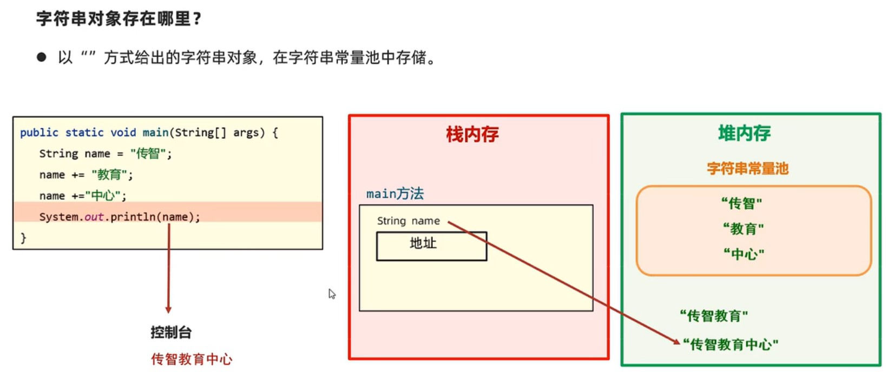
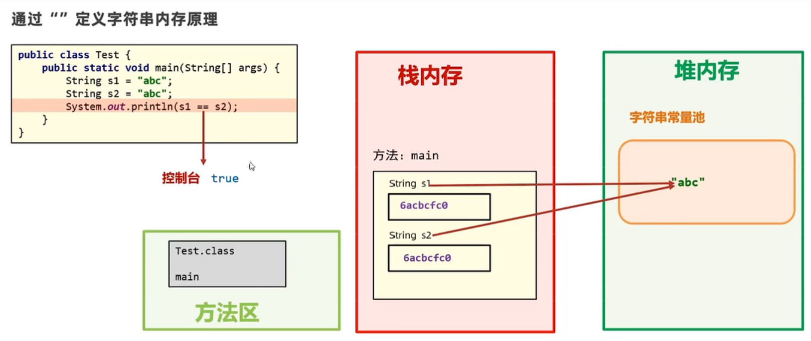
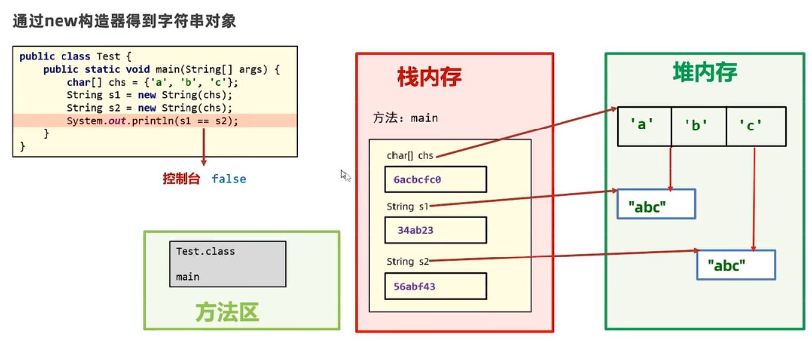

### 常用API

#### String

- String类定义的变量可用于存储字符串，同时String类提供了很多操作字符串的功能，我们可以直接使用。
- **String类被称为不可变字符串类型，它的对象在创建后不能被修改。**

```java
public static void main(String[] args) {
        String str = "abcd";
        str += "efg";
        System.out.println(str);  // abcdefg
    }
```



​		字符串对象存在于堆内存中，字符串变量只储存对象的地址，例子中"abcd"和"efg"两个字符串对象都没有被修改，但是str地址最终指向的变量是"abcdegd"这个新的字符串对象。

##### 字符串对象创建的几种方法

```java
public static void main(String[] args) {
    // 1、直接使用
    String s1 = "abcd";
    s1 += "efg";
    System.out.println(s1);  // abcdefg

    // 2、public String(char[] c)
    char[] chars = {'q', 'w', 'e', 'r'};
    String s2 = new String(chars);
    System.out.println(s2);  // qwer

    // 3、public String(byte[] b)
    byte[] bytes = {97, 98, 99, 65, 66, 67};
    String s3 = new String(bytes);
    System.out.println(s3);  // abcABC
}
```

##### 区别（面试常考）

- 以""方式给出的字符串对象，在**字符串常量池（堆内存）**中储存，而且相同的内容只会在其中储存一份
- 通过构造器new对象，每new一次都会产生一个新对象，放在**堆内存**中

```java
String ss1 = "abd";
String ss2 = "abd";
System.out.println(ss1 == ss2);  // true

String ss3 = "abc";
char[] c = {'a', 'b', 'c'};
String ss4 = new String(c);
String ss5 = new String(c);
System.out.println(ss3 == ss4);  // false
System.out.println(ss4 == ss5);  // false
```





##### 常见面试题

```java
public static void main(String[] args) {
    String s2 = new String("abc");  // 创建2个对象,"abc"放在常量池,new的对象放在堆内存
    String s1 = "abc";             // 创建了0个对象,s1地址指向"abc"
    System.out.println(s1 == s2);  // false
}
```

```java
public static void main(String[] args) {
    String s3 = "abc";      // 放在常量池
    String s4 = "ab";
    String s5 = s2 + "c";   // 只要不是""直接给出来的,运算结果都是放在堆内存
    System.out.println(s3 == s5);  // false
}
```

```java
public static void main(String[] args) {
    String s6 = "abc";
    String s7 = "a" + "b" + "c";   // java编译会直接将"a"+"b"+"c"直接编译成"abc"
    System.out.println(s6 == s7);  // true
}
```

##### 字符串内容比较

`equals(String)`：比较字符串，区分大小写

`equalsIgnoreCase(String)`：比较字符串，不区分大小写

```java
public static void main(String[] args) {
    String s1 = "abc";
    String s2 = "Abc";
    System.out.println(s1.equals(s2));           // false
    System.out.println(s1.equalsIgnoreCase(s2)); // true
}
```

 `length()`：返回字符串长度

`charAt(int index)`：获取某个索引处的字符

`toCharArray()`：将字符串转换成字符数组返回

`substring(int begin,int end)`：根据开始和结束索引进行截取，获得新的字符串（包前不包后）

`substring(int begin)`：从开始索引截取到末尾，获得新字符串

`replace(CharSequence target, CharSequence replacement)`：用新值替换字符串中的旧值

`split(String regex)`：根据传入字符切割字符串，返回字符串数组

```java
public static void main(String[] args) {
    String s1 = "abc";
    System.out.println(s1.split("b")[0]); // a
    System.out.println(s1.split("b")[1]); // c
}
```


#### ArrayList

- ArrayList代表集合类，集合是一种容器，与数组类似，不同的是**集合大小是不固定的**。
- 通过创建ArrayList的对象表示得到一个集合容器，同时ArrayList提供了比数组更好用，更丰富的API(功能)给程序员使用

> 例如：购物车功能，随时可以添加商品进来，也随时可以删除商品

#####  ArrayList创建和添加

```java
public static void main(String[] args) {
    // 创建集合对象
    ArrayList list = new ArrayList();
    
    // 添加元素
    list.add("C++");
    list.add("java");
    
    // 向指定位置添加元素
    list.add(1, "Python");

    System.out.println(list); // [C++, java]
    }
```

##### 使用泛型集合

```java
public static void main(String[] args) {
    ArrayList<String> list1 = new ArrayList<>();
    ArrayList<Integer> list2 = new ArrayList<>();

    list1.add("Python");
    // list1.add(123);  报错
    
    list2.add(123);
    //.add("asdsad");  报错

    System.out.println(list1.get(0));  // 获取集合中的元素使用get()函数
    }
```

```java
ArrayList<Movie> movies = new ArrayList<>();
// 也可以定义类集合,Movie类是自定义的一个类，集合中可加入该类的对象
```

> 在使用集合的时候，尽量用泛型

##### 集合的常用方法

`get(int idex)`：返回索引处元素

`size()`：返回集合中元素的个数

`remove(int index)`：删除指定索引处的元素，返回被删除的元素

`remove(Object o)`：删除指定元素，返回是否删除成功

`set(int index, E element)`：修改指定索引处的元素，返回被修改的元素

```java
public static void main(String[] args) {
    ArrayList<String> list3 = new ArrayList<>();
    list3.add("Python");
    list3.add("Java");
    list3.add("C++");
    list3.add("C");

    System.out.println(list3);                       // [Python, Java, C++, C]
    System.out.println(list3.get(2));                // C++
    System.out.println(list3.size());                // 4
    System.out.println(list3.remove(2));             // C++
    System.out.println(list3.set(1, "JavaScript"));  // Java
    System.out.println(list3);                       // [Python, JavaScript, C]
}
```

##### ArrayList遍历以及删除

##### 方法一

```java
public static void main(String[] args) {
    ArrayList<Integer> list = new ArrayList<>();
    list.add(98);        
    list.add(77);
    list.add(66);
    list.add(89);
    list.add(79);
    list.add(50);
    list.add(100);
    System.out.println(list);  // [98, 77, 66, 89, 79, 50, 100]
    for (int i = 0; i < list.size(); i++) {
        int score = list.get(i);
        if (score < 80) {
            list.remove(i);
            i--; // 删除成功后必须退一步,保证下次回到这个位置,否则会有bug
        }
    }
    System.out.println(list);  // [98, 89, 100]
}
```

##### 方法二

```java
public static void main(String[] args) {
    ArrayList<Integer> list = new ArrayList<>();
    list.add(98);        
    list.add(77);
    list.add(66);
    list.add(89);
    list.add(79);
    list.add(50);
    list.add(100);
    System.out.println(list);  // [98, 77, 66, 89, 79, 50, 100]
    for (int i = list.size() - 1; i >= 0; i--) {  // 倒序来遍历元素
        int score = list.get(i);
        if (score < 80) {
            list.remove(i);
        }
    }
    System.out.println(list);  // [98, 89, 100]
}
```

