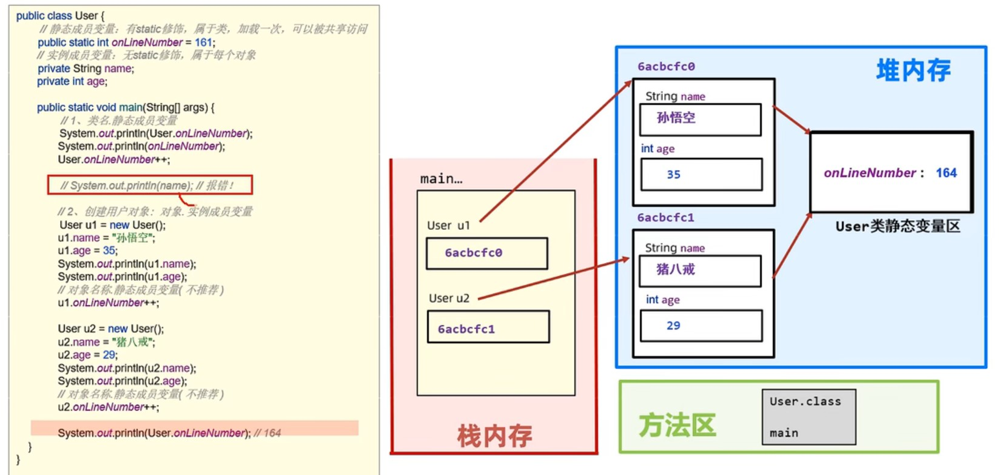
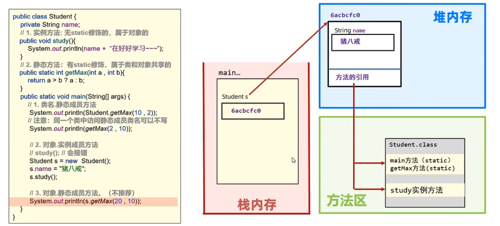

### 面向对象进阶

#### static

- static是**静态**的意思，可以修饰成员变量和成员方法
- static修饰成员变量表示该成员变量**只在内存中储存一份**，可以被**共享访问、修改**

##### User类

```java
public class User {
    public static int onlineNumber = 161; // static修饰,共享访问
}
```

##### main

```java
public static void main(String[] args) {
    System.out.println(User.onlineNumber);
}
```

​		所有对象共享一个onlineNumber变量，可以直接`类名.成员变量`的方法来访问onlineNumber

##### 区别/对比

- 有static修饰：属于类，如在线人数等需要被共享访问的属性
- 无static修饰：实例成员变量，只有对象可以访问，不能用`类名.成员变量`的方法来访问

```java
public class User {
    public static int onlineNumber = 161; // static修饰,共享访问
    private String name;  // 每个对象的属性
}
```

##### 内存机制



#### static修饰方法

```java
public class Student {
    private String name;

    // static静态成员方法
    public static int Max(int age1, int age2) {
        return age1 > age2 ? age1 : age2;
    }

    // 实例方法,无static
    public void study() {
        System.out.println(this.name + " is studying now!");
    }

    public static void main(String[] args) {
        // 调用静态成员方法
        System.out.println(Student.Max(12, 56));
        System.out.println(Max(34, 21));  // 同一类中调用可以省略类名

        // 调用实例方法
        Student s = new Student();
        s.name = "Mike";
        s.study();
    }
}
```

​		**static修饰的方法可以直接调用，无static修饰的方法表示对象的行为，必须通过对象来调用**

##### 内存机制



##### 注意事项

- 静态方法只能访问静态成员，不能直接访问实例成员，需要通过对象访问
- 实例方法可以访问静态成员，也可以访问实例成员
- 静态方法中不可以出现this关键字

#### 应用知识

##### 工具类

- 内部都是一些静态方法，每个方法完成一个功能
- 一次编写，可以反复利用，提高代码重用性
- 建议将工具类的构造器私有化处理，无法创建对象（专业）

##### 代码块

- 代码块是类的5大成分之一（成员变量、构造器、方法、**代码块**、内部类），定义在类中方法外
- 在Java类下，使用{}括起来的代码被称为代码块

###### 静态代码块：

- **格式**：static{}
- **特点**：需要通过static修饰，随着类加载而加载，并且自动触发，只执行一次
- **使用场景**：在类加载的时候做一些静态数据初始化的操作，以便后续使用

```java
public class School {
    private static String SchoolName;

    static {
        System.out.println("静态代码块被触发执行了");
        SchoolName = "Donghua";                      // 只能访问静态成员变量
    }

    public static void main(String[] args) {
        System.out.println("main方法执行");
        System.out.println("SchoolName:" + SchoolName);
    }
}
// 静态代码块被触发执行了
// main方法执行
// SchoolName:Donghua
```

###### 构造代码块（了解，见的少）：

- **格式**：{}
- **特点**：每次创建对象，调用构造器执行时，都会执行该代码块中的代码，并且在构造器执行前执行
- **使用场景**：初始化实例资源

```java
public class School2 {
    public School2() {
        System.out.println("无参构造器被触发执行");
    }

    {
        System.out.println("实例代码块被触发执行");
    }

    public static void main(String[] args) {
        School2 s1 = new School2();
        School2 s2 = new School2();
    }
}
// 实例代码块被触发执行
// 无参构造器被触发执行
// 实例代码块被触发执行
// 无参构造器被触发执行
```

##### 设计模式

- 开发中经常遇到一些问题，一个问题通常有n种解法，但其中肯定有一种最优解，这个最优解称为设计模式
- 设计模式有20多种，对应20多种软件开发中会遇到的问题，单例模式就是其中一种

##### 单例模式

- 保证系统中，应用该模式的这个类永远只有一个实例，即一个类只能创建一个对象
- 例如任务管理器对象我们只要一个就能解决问题了，这样可以节省空间

###### 设计步骤：

- 定义一个类，把构造器私有
- 定义一个静态变量储存一个对象

###### 饿汉单例模式：

```java
public class SingleInstance {
    // 定义唯一一个对象instance
    public static SingleInstance instance = new SingleInstance();
    
    // 私有化构造器
    private SingleInstance(){}
}
```

```java
public static void main(String[] args) {
    SingleInstance s1 = SingleInstance.instance;
    SingleInstance s2 = SingleInstance.instance;
    System.out.println(s1 == s2);
}
// true 指向同一个对象
```

###### 懒汉单例模式

- 真正需要该对象的时候，才去创建一个对象（延迟加载对象）
- 提供一个返回单例对象的方法

```java
public class lanhan {
    // 私有化,不然容易被挖坑
    private static lanhan instance;
    
    // 私有化构造器
    private lanhan(){}

    // 返回对象的方法
    public static lanhan getInstance() {
        if (instance == null) {
            instance = new lanhan();
        }
        return instance;
    }
}
```

```java
public static void main(String[] args) {
    lanhan s1 = lanhan.getInstance();
    lanhan s2 = lanhan.getInstance();
    System.out.println(s1);
    System.out.println(s2);
}
```


#### 继承 extend

`public class Student extends People`：Student继承People类

- 使用extends让两个类建立父子关系
- 提高代码复用性，减少代码冗余

##### People类

```java
public class People {
    private String name;
    private int age;

    public String getName() {
        return name;
    }
    public int getAge() {
        return age;
    }
    public void setName(String name) {
        this.name = name;
    }
    public void setAge(int age) {
        this.age = age;
    }
}
```

##### Student类

```java
public class Student extends People {
    public void checkClass() {
        System.out.println(this.getName() + " is checking classes!");
    }
}
```

##### 主程序

```java
public class test {
    public static void main(String[] args) {
        Student s = new Student();
        s.setAge(18);
        s.setName("Mike");
        s.checkClass();
    }
}
// Mike is checking classes!
```

##### 内存机制


##### 特点

- 子类不能继承父类的构造器
- 子类能继承父类的**私有方法**，但是不能直接访问**（有争议，也能说是不能继承）**
- 子类能共享父类的**静态成员**，静态成员属于父类本身

##### People

```java
public class People {
    
    ...
        
    private void test() {
        System.out.println("私有成员");
    }

    public static String location = "Earth";
}
```

##### 主程序

```java
public class test {
    public static void main(String[] args) {
        System.out.println(s.location);  // 不会报错，但会标黄
        System.out.println(People.location);  // 正确方法
    }
}
```

- Java不支持多继承：`class 子类 extends 父类A, 父类B{}`
- Java支持多层继承：`子类A 继承 父类B，父类B 继承 父类C`，如果 父类B 和 父类C 中有同样的方法函数，子类A调用时会优先使用 父类B 的，**就近原则**
- Java所有类都是Object的子类

#### 子类访问

- 子类方法中访问**成员变量、成员方法**都满足 **就近原则**

- **super关键字可以访问父类的属性**

##### Animal、Dog类

```java
public class Animal {
    public String name = "动物名(父类名)";
}

class Dog extends Animal {
    public String name = "狗名(子类名)";

    public void showName() {
        String name = "局部名";
        System.out.println(name);  // 访问局部名
        System.out.println(this.name);  // 访问当前类的属性name
        System.out.println(super.name);  // 访问父类名
    }
}
```

##### 主程序

```java
public class test {
    public static void main(String[] args) {
        Dog d = new Dog();
        d.showName();
    }
}
// 局部名
// 狗名(子类名)
// 动物名(父类名)
```

#### 继承后：方法重写

```java
// 父类
public class Phone {
    public void call() {
        System.out.println("打电话~~");
    }

    public void sendMsg() {
        System.out.println("发短信~~");
    }
}

// 子类
class NewPhone extends Phone {
    @Override
    public void call() {                         // 重写call方法
        super.call();  // 先使用父类的功能
        System.out.println("开始视频通话~~");
    }

    @Override
    public void sendMsg() {                      // 重写sendMsg方法
        super.sendMsg();  // 使用父类功能
        System.out.println("发送有趣图片~~");
    }
}
```

##### @Override

- 重写校验注解，加上之后，这个方法必须是正确重写的，这样更安全

- 提高程序可读性，代码优雅

##### 重写注意事项

- 重写方法**名称**和**形参列表**必须与被重写方法一样
- 私有方法不能被重写
- 子类重写方法时，访问权限必须大于等于父类（public>protected>缺省）
- 子类不能重写父类的静态方法，会报错

#### 继承后：构造器

- 子类中所有构造器都会默认先访问父类中的无参构造器，再执行自己的

> **why？**
>
> 子类在初始化的时候，有可能会使用到父类的数据，如果父类没有完成初始化，子类将无法使用父类的数据
>
> 子类初始化之前，一定要调用父类构造器先完成父类空间的初始化
>
> 子类构造器第一行默认语句：super() 写不写都存在

##### 访问有参数构造器

##### People

```java
public class People {
    private String name;
    private int age;

    // 无参数构造器
    public People(){}
    // 有参数构造器
    public People(String name, int age) {
        this.name = name;
        this.age = age;
    }
}
```

##### Student

```java
public class Student extends People {
    // 无参数构造器
    public  Student(){}
    // 有参数构造器
    public Student(String name, int age) {
        super(name, age);  // 调用父类构造器
    }

    public void checkClass() {
        System.out.println(this.getName() + " is checking classes!");
    }
}
```

- **如果父类中没有无参数构造器，只有有参数构造器，会报错，因为子类默认是调用父类无参数构造器的**

##### this调用本类构造器

```java
public class Student extends People {
    // 无参数构造器
    public Student() {
    }
    // 有参数构造器
    public Student(String name, int age) {
        super(name, age);
    }

    // 调用本类构造器，如果不输入age，默认为18
    public Student(String name) {
        this(name, 18);
    }

    public void checkClass() {
        System.out.println(this.getName() + " is checking classes!");
    }
}
```

